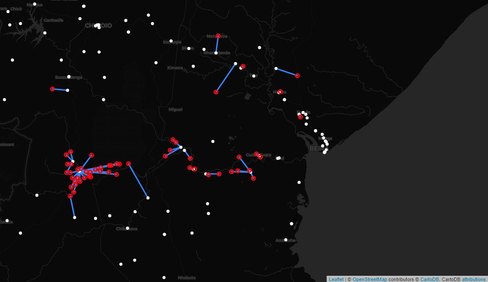

# DTM-healthsites

This is an example of how to combine data from DTM and Healthsites.io, using OSRM to estimate travel time (by foot) from each displacement site to the nearest health facility. This example uses DTM data from Mozambique.



## Installation
- *Presrequisite:* Install [git](https://git-scm.com/book/en/v2/Getting-Started-Installing-Git) and [miniconda](https://docs.conda.io/en/latest/miniconda.html)
- Run ```git clone https://github.com/brianmcdonald/DTM-healthsites.git```
- Run ```cd DTM-healthsites``` and ```conda env create```
- Run ```jupyter lab```

